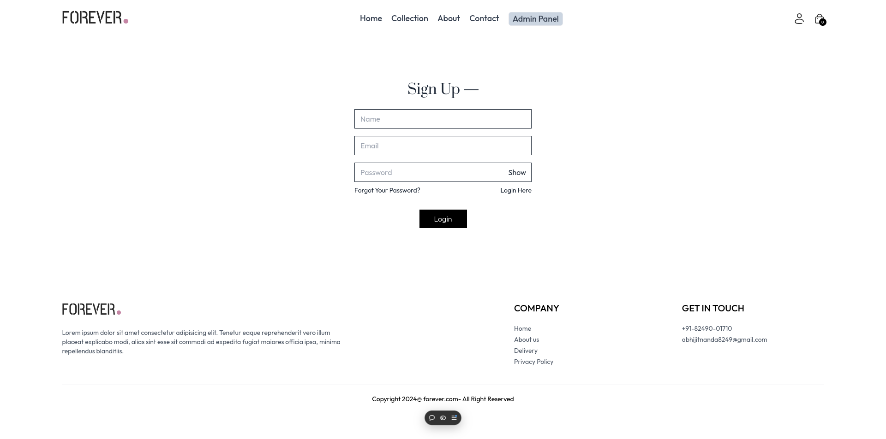

<!-- Waving Header -->


<div align="center">
Welcome to <b>Forever E-commerce</b>, a full-stack e-commerce platform built with the MERN stack (MongoDB, Express.js, React, Node.js) and deployed on Vercel. This project delivers a <b>seamless shopping experience</b> for users and a <b>robust admin panel</b> for managing products and orders. Scroll down to explore its features, tech stack, and the challenges I conquered to bring it to life!
</div>

---
<!-- Waving Header -->

## 🌟 Tech Stack

Here’s the technology powering Forever E-commerce, presented with some flair:

| Technology       | Description                                      | Badge                                                                 |
|------------------|--------------------------------------------------|----------------------------------------------------------------------|
| **React JS**     | Dynamic, responsive frontend with reusable components | [](https://reactjs.org/) |
| **Node.js**      | Backend runtime for scalable server-side logic   | [](https://nodejs.org/) |
| **Express**      | Robust APIs for seamless data flow              | [](https://expressjs.com/) |
| **MongoDB**      | Reliable NoSQL database for data storage        | [](https://www.mongodb.com/) |
| **Stripe**       | Secure payment gateway integration              | [](https://stripe.com/) |
| **Vercel**       | Smooth deployment for global access             | [](https://vercel.com/) |

---

## 🚀 Features

### User Features
- **Homepage**: Browse best-sellers and latest collections with a single click to view product details.  
- **Collection Page**: Filter products by category, subcategory, or price (low to high or vice versa).  
- **About Page**: Learn about our mission, product quality, and why Forever E-commerce stands out.  
- **Contact Page**: Reach out with queries using our contact information.  
- **Login & Register**: Secure authentication with JWT tokens for returning and new users.  
- **Cart Page**: Add products with size selection and review items before checkout.  
- **Payment Page**: Choose from COD, Stripe, or Razorpay for a smooth checkout experience.  
- **Orders Page**: Track all your orders from the profile section post-purchase.  

### Admin Features
- **Admin Login**: Secure login for admins using JWT tokens.  
- **Add Products**: Upload product details and images from multiple angles.  
- **All Products**: View and delete products as needed.  
- **All Orders**: Manage order statuses for all user purchases.  

---

## 📸 Screenshots

### User Interface
#### Homepage
  
*Best-sellers and latest collections at your fingertips.*

#### Collection Page
  
*Filter and explore all products with ease.*

#### About Page
  
*Discover our mission and values.*

#### Contact Page
  
*Get in touch with us anytime.*

#### Login & Register
  
  
*Secure access for all users.*

#### Cart Page
  
*Review your selections before purchase.*

#### Payment Page
  
*Multiple payment options for convenience.*

#### Orders Page
  
*Track your purchases effortlessly.*

### Admin Interface
#### Admin Login
  
*Secure admin access.*

#### Add Products
  
*Easily add new products.*

#### All Products
  
*Manage the product catalog.*

#### All Orders
  
*Update order statuses in real-time.*

---

## ⚡ Challenges & Difficulties

Building Forever E-commerce was no small feat! Here are the major hurdles I encountered:

- **Long Development Hours**: I dedicated **8-10 hours a day for 10 days straight** to bring this project to life. Balancing frontend polish, backend stability, and feature integration was exhausting but rewarding.  
- **Vercel Deployment Headaches**: Deploying the backend on Vercel posed significant challenges, particularly with **MongoDB** and **bcrypt**.  
  - **MongoDB**: Ensuring compatibility with Vercel’s serverless environment required tweaking connection settings and handling cold starts.  
  - **bcrypt**: Dependency issues arose due to Vercel’s build process, which I resolved by switching to a prebuilt binary and adjusting the deployment configuration.  
- **Solution**: Hours of debugging, community forums, and trial-and-error led to a stable deployment. Persistence paid off!

These challenges taught me valuable lessons in problem-solving and optimization, making the final product even more satisfying.

---

## 🛠️ Installation & Setup

Ready to run Forever E-commerce locally? Follow these steps:

### Prerequisites
- Node.js installed
- MongoDB Atlas account (or local MongoDB instance)
- Stripe API keys

### Steps
1. **Clone the Repository**
   ```bash
   git clone https://github.com/AimTheSun/ecommerce-forever.git
   ```

2. **Navigate to the Project Directory**
   ```bash
   cd ecommerce-forever
   ```

3. **Install Frontend Dependencies**
   ```bash
   cd frontend/
   npm i
   ```

4. **Install Admin Dependencies**
   ```bash
   cd ../admin/
   npm i
   ```

5. **Install Backend Dependencies**
   ```bash
   cd ../backend/
   npm i
   ```

6. **Set Up Environment Variables**
   - Create `.env` files in `frontend/`, `admin/`, and `backend/` with the required keys (e.g., MongoDB URI, JWT secret, Stripe key, etc.).

7. **Start the Application**
   - Run each part separately in different terminals:
     ```bash
     cd frontend/ && npm start
     cd admin/ && npm start
     cd backend/ && npm run dev
     ```

---

## 🌐 Deployment

Forever E-commerce is proudly hosted on **Vercel** for fast, global access. The deployment process involved:
- Pushing the frontend and admin to Vercel via Git integration.
- Configuring the backend as a serverless function, overcoming MongoDB and bcrypt issues (detailed in Challenges).

Visit the live site: [https://forever-frontend-ochre-rho.vercel.app](#)

---

## 🔮 Future Improvements

- Add product reviews and ratings.
- Implement a wishlist feature for users.
- Enhance admin analytics with sales dashboards.

---

**Don’t forget to ⭐ star the repository if you like it!**  
Thank you for visiting Forever E-commerce!

---
